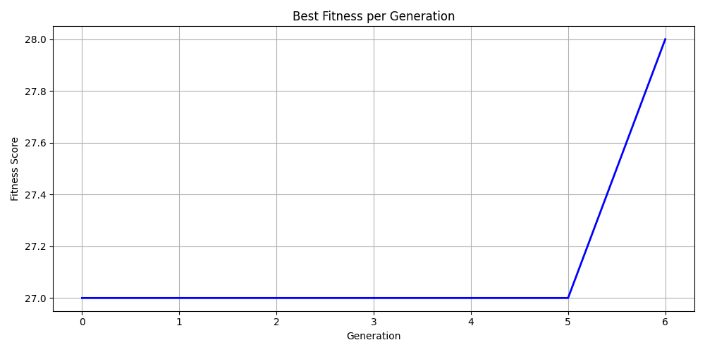

# 8-Queens Problem Solved Using Genetic Algorithm

## 🔹 1. Problem Description

The 8-Queens problem is a classic AI challenge:
- Place 8 queens on a standard 8x8 chessboard
- No two queens may attack each other (no same row, column, or diagonal)

---

## 🔹 2. Why Genetic Algorithm?

Genetic Algorithm (GA) is a metaheuristic inspired by natural selection.  
It's useful when:
- The search space is large
- An optimal or near-optimal solution is acceptable
- Traditional methods (e.g., backtracking) are too slow or memory-intensive

---

## 🔹 3. How GA Works Here

Each solution is encoded as a chromosome:
- Example: `[4, 6, 1, 5, 2, 0, 3, 7]`
- Index = column, Value = row position of the queen

The algorithm includes:
- Fitness Function → max score = 28 (no attacking pairs)
- Selection → Tournament Selection
- Crossover → Single Point
- Mutation → Random swap with small probability

---

## 🔹 4. Implementation Overview

Main files:

- `genetic.py`: Defines all core GA logic (generation, fitness, selection, crossover, mutation)
- `main.py`: Runs the simulation and visualizes results
- `visualize.py`: Draws the chessboard with queens and fitness graph

Technologies used:
- Python
- matplotlib
- `.venv` for environment isolation
- `requirements.txt` & `.gitignore`

---

## 🔹 5. Outputs

### ✅ Sample Final Solution

🟦 Solution (queens):  
`[4, 6, 1, 5, 2, 0, 3, 7]`

📸 Chessboard Visualization:

📈 Fitness Progress:

---

## 🔹 6. Conclusion

GA successfully finds non-attacking queen placements.
- ✅ Efficient for small N
- ❗ May need tuning for large N (mutation/crossover rates)

---

## 🔹 7. GitHub Repository

🔗 https://github.com/ismailzohari/The-8-Queens

---

© 2025 EP
